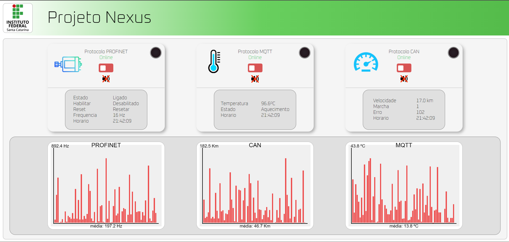

# Nexus — Website

    

 

Este repositório contém a **continuação e evolução pessoal do website desenvolvido para o Projeto Nexus**, originalmente criado durante a disciplina de `Comunicação de Dados` do curso de Eletrônica Industrial.

O Projeto Nexus consiste em um sistema de automação distribuído composto por três células utilizando diferentes protocolos de comunicação: **PROFINET, CAN e MQTT**. O website foi desenvolvido como uma interface externa para monitoramento dos dados do sistema através da internet.

> A arquitetura, funcionamento e documentação do projeto acadêmico original estão disponíveis no [repositório do Projeto Nexus](https://github.com/MatheusPinto/Project_Nexus).

## Evolução do website

Após a conclusão do projeto acadêmico, o desenvolvimento do website continuou de forma independente, com foco na melhoria da interface, visualização dos dados e organização do código.

Entre as funcionalidades posteriormente desenvolvidas estão:

- monitoramento dos estados dos protocolos PROFINET, CAN e MQTT;
- Identificação da disponibilidade dos protocolos através do último dado recebido;
- Atualização periódica das informações apresentadas no dashboard;
- Gráficos em tempo real desenvolvidos diretamente com a API `<canvas>` do HTML;
- Ajuste automático da escala dos gráficos de acordo com os valores recebidos;
- Armazenamento de um histórico limitado de amostras para visualização;
- Suporte a valores positivos, negativos e diferentes ordens de grandeza;
- Interface adaptada para computadores e dispositivos móveis;
- Integração entre frontend, PHP, MySQL e Node-RED.

  

## Gráficos em tempo real

Os gráficos do dashboard foram implementados diretamente utilizando o elemento **HTML Canvas**, sem bibliotecas externas de visualização.

As amostras recebidas são armazenadas temporariamente no navegador e utilizadas para atualizar os gráficos em tempo real. A escala vertical é calculada dinamicamente a partir dos dados armazenados, permitindo que o gráfico se adapte a diferentes amplitudes e também a valores positivos e negativos.

Essa implementação foi desenvolvida como exercício de aprofundamento no funcionamento de sistemas de visualização de dados e manipulação gráfica com JavaScript.

## Tecnologias

- HTML
- CSS
- JavaScript
- PHP
- MySQL
- Node-RED

## Projeto original

Este website teve origem como parte de um projeto acadêmico coletivo. Para informações sobre a arquitetura completa do sistema, dispositivos utilizados e implementação dos protocolos de comunicação, consulte:

**[Projeto Nexus — Repositório original](https://github.com/MatheusPinto/Project_Nexus)**

A documentação específica da primeira versão do website também está disponível na seção [`nexus-web`](https://github.com/MatheusPinto/Project_Nexus/tree/main/nexus-web).
